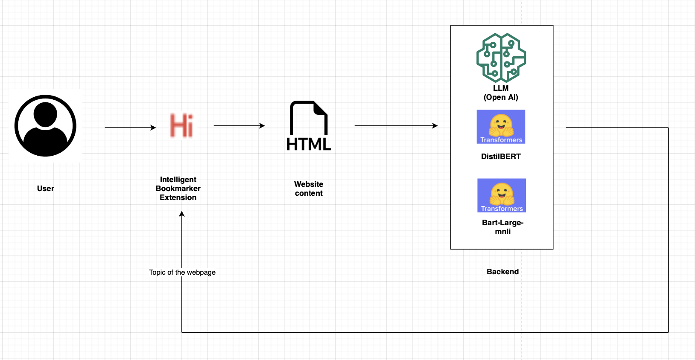

# Intelligent Bookmarker

# User Interaction Flow
 

For a quick demo, refer [here](https://illinois.zoom.us/rec/share/mUqsMp2FGyJ6oTAbdhjBAJB--Q7-ULspJV4Af8EDBE8i3eZHYGwciY91iaULPGi2.OIxk56vdq50l6sKr?startTime=1684021005000)

# Set Up
* Download and extract the zip file or clone the project to your local.
* /yourpath/Intelligent-Bookmarker/ is our root folder

* Go to chrome://extensions/ and turn on the developer mode in the top right corner of the page.
* Remove the generated __pycache__ folder from the project after running the "python app.py"
* Click on "Load unpacked" on the top left and select the /yourpath/Intelligent-Bookmarker/ folder.
* Open a new tab and you should now be able to see the "Intelligent Bookmarker" extension among your browser extensions.

Install dependencies in the folder to start the server
###
* pip install flask flask-cors scikit-learn bs4 transformers requests
* pip install gensim torch openai
###
* Go to https://platform.openai.com/account/api-keys to get your Secret Key from Open AI. (If you are having trouble getting your secure keys, you can reach out to any of the developers).
* Open key.conf and enter your secret key in a single line. It will be read by openai_classification.py (line 11)
* Run python app.py in /yourpath/Intelligent-Bookmarker/ (It could take up to one minute for the first time to start the server - Subsequent starts may be quicker)

Wait until you receive,  

 * Serving Flask app 'app'
 * Debug mode: on
WARNING: This is a development server. Do not use it in a production deployment. Use a production WSGI server instead.
 * Running on http://127.0.0.1:5000
Press CTRL+C to quit
 * Restarting with watchdog (windowsapi)
 * Debugger is active!
 * Debugger PIN: xxx-yyy-zzz

# Usage

* Browse to any tab.
* Click on the extension and select the "Bookmark and Categorize" button.
* You can find that bookmark is automatically categorized and added to a folder.
* Add more tabs and populate your bookmarks to folders representing categories.

# Getting Access to API KEY
* Open AI prevents commiting of API KEY to GitHub or any online service and thus leads to revocation of the key.
* Hence, we request the user of the tool to get your own secure keys by following the instructions above or contact the contributors for getting access to the API KEY.
* Kindly, send email to either of the emails provided.
* kc62@illinois.edu, uk3@illinois.edu, srirame2@illinois.edu
